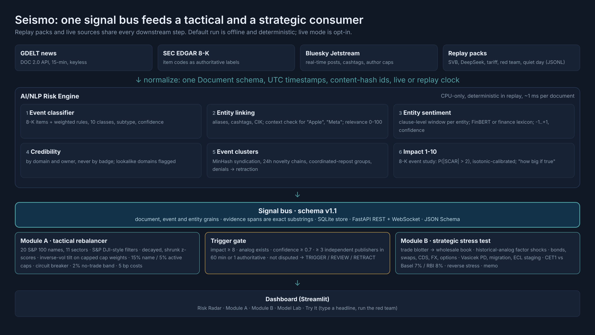
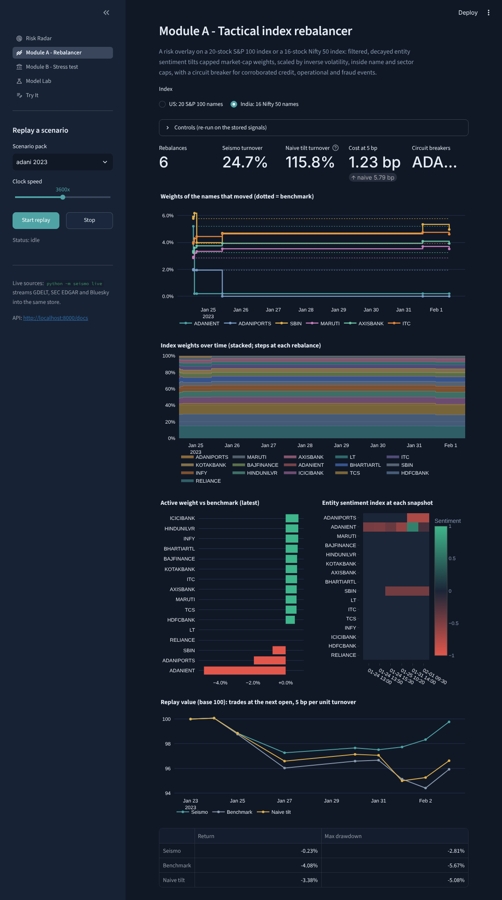
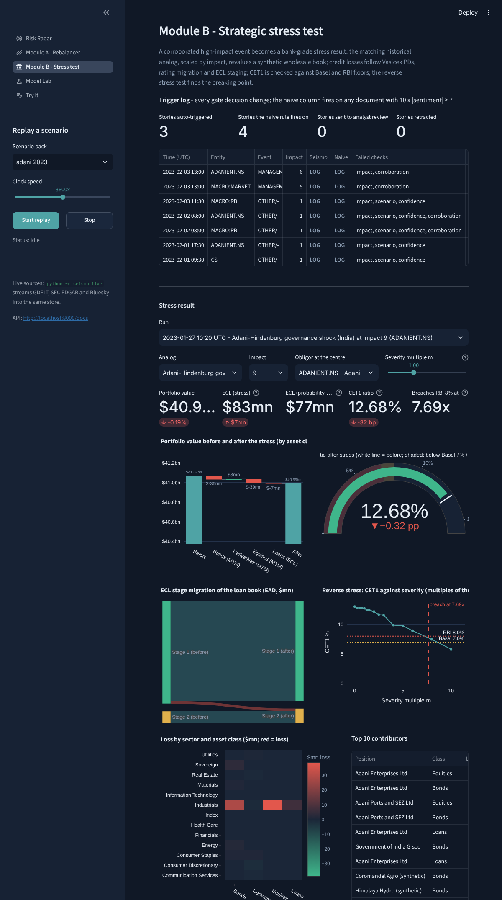

# Seismo: an AI/NLP Risk Engine for Market-Moving News - S&P Global & Crisil Campus Hackathon

**Candidate Name:** Pawan Sharma
**College Email ID:** pawan.iitkgpmaveric@kgpian.iitkgp.ac.in
**College / Campus:** Indian Institute of Technology Kharagpur
**Demo Video Link:** [YouTube, unlisted - added before submission]
**Slide Deck Link (if hosted externally):** not hosted externally; see [`docs/presentation.pdf`](docs/presentation.pdf)
**Live dashboard (no install):** https://iitkgp-pawan-sharma-hackathon-cbprsqney5pesw6pfijjrc.streamlit.app/ (Streamlit Community Cloud; the first visit can take a minute to wake the app)



## 1. Project Overview / Problem Statement & Approach

News now moves risk faster than risk systems can read it. Silicon Valley Bank lost $42 billion of
deposits in one day in March 2023 in a run organised in group chats; in January 2023 a short
seller's report wiped more than $100 billion off the Adani group in a week and sent RBI asking
banks for their exposure; in January 2025 Nvidia lost about $589 billion in one session after a
weekend of coverage of a cheaper rival AI model. A risk desk needs a machine-readable answer
within minutes: which company, how negative, what kind of event, how severe, and **is it real**.

Seismo measures the magnitude of market-moving news the way a seismograph measures a tremor. It
ingests news (GDELT), regulatory filings (SEC EDGAR 8-K) and social posts (Bluesky), links each
document to the US and Indian companies and macro factors it mentions, and emits one evolving
signal per *event*, not per post: entity-level sentiment (-1 to +1) from a model trained on
14,345 labelled Indian financial headlines, event class, a calibrated impact score (1-10),
novelty, relevance, corroboration by independent publishers, and the exact evidence text behind
every score. It is tested on replays of crises whose outcome is known, on **real article streams
from GDELT**, and on real labelled data.

Both downstream modules consume the same signal bus. **Module A** is the tactical consumer: a
risk overlay that tilts a 20-stock S&P 100 index or a 16-stock Nifty 50 index on filtered
sentiment, inside name, active and sector caps, with a circuit breaker. **Module B** is the
strategic consumer: a corroborated, high-impact event triggers a stress test of a synthetic US and
India wholesale banking book in a bank's own language: historical-analog shocks computed from
market data, Vasicek PDs, rating migration, group contagion, IFRS 9 / RBI ECL staging, CET1 against
Basel and RBI floors, and a reverse stress test. A five-check **trigger gate** sits in between, so
one viral fake cannot launch a stress test, and a company's denial cannot bury a story that
independent newsrooms have confirmed.

## 2. Architecture & Tech Stack

The diagram above is the data flow (source: [`docs/src/architecture.html`](docs/src/architecture.html)).

| Layer | Technology | Why |
| --- | --- | --- |
| Contracts | Pydantic v2; JSON Schema in [`docs/signal_schema.json`](docs/signal_schema.json) (v1.1) | Every message typed and validated; evidence spans must be exact substrings of the source |
| Bus | In-memory asyncio bus behind a Kafka-shaped interface, keyed by entity | Per-entity ordering; same code for the laptop demo and a streaming deployment |
| Sentiment | Target-masked logistic regression trained on SEntFiN 1.0 (scikit-learn, weights as JSON); finance lexicon fallback; FinBERT on request | Scores each company separately, on CPU, about 1 ms per document |
| Engine | Alias/context entity linker (US + NSE names); 8-K items + weighted event rules; MinHash event clustering; owner-aware corroboration; lookalike and coordination detection; denials that retract rumours but only contest confirmed stories | Transparent and deterministic in replay |
| Impact | 8-K event study (market model, SCAR, logistic + isotonic, time split) with a documented logit prior for events 8-Ks cannot see | Impact means a calibrated chance of a two-sigma move, not an LLM's guess |
| Module A | Filtered, decayed, shrunk z-scores; inverse-vol tilt on capped cap weights; caps, breaker (with group freeze), no-trade band; replay P&L at the next open with costs | S&P DJI sentiment-index rules, made event-driven; US and India |
| Module B | Seeded trade blotter -> 257 positions (US and India desks); duration-convexity, DV01, CS01, delta-gamma-vega; Vasicek/Basel IRB PD; group contagion; ECL staging; RWA; CET1; reverse stress | The language of a credit-risk and capital team |
| Store / API | SQLite (WAL); FastAPI REST + WebSocket, OpenAPI at `/docs` | Dashboard reads while the pipeline writes |
| Dashboard | Streamlit + Plotly, five pages | Risk Radar, Module A, Module B, Model Lab, Try It |
| Quality | pytest (80+ tests incl. finance maths, replay behaviour, API), ruff, GitHub Actions | Reviewable and reproducible |

Repository layout: `src/seismo/` (`ingest/`, `nlp/`, `signals/`, `module_a/`, `module_b/`, `eval/`,
`bus/`, `store/`, `api/`, `ui/`), `data/` (universes, replay packs, real-news packs, SEntFiN, gold
set, blotter, market data, `MANIFEST.yaml`), `config/` (thresholds, scenario library), `models/`
(sentiment and impact weights as JSON), `docs/` (deck, architecture, results, model and data
cards), `scripts/` (data download, pack builder), `tests/`.

## 3. Dataset Used

| Data | Source | Notes |
| --- | --- | --- |
| Universes | 20 S&P 100 names (CIKs from SEC `company_tickers.json`); 16 Nifty 50 names (NSE symbols) | All 11 GICS sectors in the US; the Adani group is tagged as a business group |
| **SEntFiN 1.0** | [Sinha et al., 2023](https://arxiv.org/abs/2305.12257), via [Kaggle](https://www.kaggle.com/datasets/ankurzing/aspect-based-sentiment-analysis-for-financial-news) | 10,753 Economic Times headlines, 14,404 entity-level labels; trains and tests the sentiment model |
| **Real news** | [GDELT 2.0](https://www.gdeltproject.org/) event exports, `data/gdelt/` and `data/replay/*_gdelt.jsonl` | Real article URLs, publishers and timestamps for the SVB week, the Adani week and a quiet control week (1,024 articles, 591 publishers). Headlines are rebuilt from URL slugs |
| Live sources | [GDELT DOC 2.0](https://blog.gdeltproject.org/gdelt-doc-2-0-api-debuts/), [SEC EDGAR](https://www.sec.gov/os/accessing-edgar-data), [Bluesky Jetstream](https://atproto.com/guides/streaming-data) | Free and keyless. X has no free read access; NewsAPI's free tier delays articles 24 hours |
| Reconstructed replays | `data/replay/*.jsonl`, built by `scripts/build_replay_packs.py` | SVB, DeepSeek, the tariff shock and Adani-Hindenburg are **synthetic reconstructions**: paraphrased headlines timed to the public record, `.example` stand-in publishers, invented social posts. The red team ("Harbor National Bank") and the quiet day are fictional. Every record is flagged `"synthetic": true` |
| Market data | Yahoo Finance (yfinance), FRED, SEC EDGAR via `make data` | US and NSE prices, Nifty 50 and Nifty Bank, Treasury curve, credit spreads, VIX, FX, oil, India 10y; 8-K history for the event study |
| Wholesale book | `data/blotter/` from `python -m seismo blotter` (seeds 2026, 2027) | Invented exposures; public names appear only as obligors; internal ratings are synthetic |
| Gold set | `data/gold/headlines.jsonl` | 50 author-labelled illustrative headlines (a sanity check) |

Assumptions stated openly:
- The brief asks Module B to use "the provided sample transaction data", but the suggested public
  datasets are retail. Seismo builds the wholesale equivalent: a trade blotter aggregated into
  loans, bonds, derivatives and equities.
- PDs by rating are smoothed from S&P Global Ratings' public default studies; staging thresholds
  are illustrative proxies, not RBI's exact rules. The Adani group lines (about 4% of the book)
  are sized by hand so the scenario is material.
- India benchmark weights use today's share counts x the 2023 adjusted close (HDFC Bank's 2023
  merger issuance overstates its weight, which the 15% name cap absorbs). Survivorship bias from
  today's index membership.
- All data is public or synthetic. No S&P Global or Crisil client data and no proprietary data is
  used. Every file is listed with source, licence, row count and SHA-256 in
  [`data/MANIFEST.yaml`](data/MANIFEST.yaml); see also [`docs/cards/data_cards.md`](docs/cards/data_cards.md).

## 4. Quickstart & Installation

Runtime: Python 3.11+ on Windows, macOS or Linux (developed on Python 3.12-3.14).

```bash
git clone https://github.com/Drona-OP/iitkgp-pawan-sharma-hackathon.git
cd iitkgp-pawan-sharma-hackathon
python -m venv .venv
source .venv/bin/activate            # Windows: .venv\Scripts\activate
pip install -r requirements.txt
pip install -e .
python -m seismo demo
```

`python -m seismo demo` opens the dashboard at http://localhost:8501, serves the API at
http://localhost:8000/docs and starts the DeepSeek replay. No API keys are needed. Pick another
pack in the sidebar: SVB, Adani-Hindenburg, the tariff shock, the red team, the quiet day, or one
of the three real-news GDELT packs. Docker: `docker compose up`.

| Command | What it does |
| --- | --- |
| `make results` | Regenerates every number in this README and the deck into `docs/results/` |
| `make sentiment` | Trains and evaluates the sentiment model on SEntFiN -> `models/sentiment_target.json` |
| `make data` | Downloads public market data and the GDELT windows (set `SEISMO_EDGAR_USER_AGENT` first) |
| `make shocks` / `make impact` | Computes the crisis-analog shocks / trains the impact event study |
| `python -m seismo stress --scenario adani_2023 --impact 10 --entity ADANIENT.NS` | One Module B run, printed as a risk memo |
| `python -m seismo analyze "Infosys gains while TCS slides on weak guidance"` | Score one headline |
| `python -m seismo live --minutes 45 --record data/replay/live.jsonl` | Stream live sources and record a pack |
| `pytest` | Test suite |

## 5. Key Results & Domain Impact

Every number below is produced by `make sentiment` and `make results` (see
[`docs/results/results.md`](docs/results/results.md)), on CPU, with real market data.

**1. Sentiment that knows which company it is about (real labelled data).** On a held-out 20% of
SEntFiN (split by headline, 2,869 entity pairs):

| System | Accuracy | Macro-F1 | Macro-F1 on headlines where entities move in opposite directions |
| --- | --- | --- | --- |
| Finance lexicon, whole headline (naive) | 0.610 | 0.608 | 0.456 |
| Same model without target masking (ablation) | 0.783 | 0.785 | 0.508 |
| **Seismo, target-masked** | **0.821** | **0.820** | **0.691** |

Fine-tuned GPU transformers reach about 0.93 in the SEntFiN paper; Seismo trades some accuracy
for a transparent model that runs in about 1 ms on a CPU.

**2. The gate fires on real crises and holds on the fake** (reconstructed replays). Naive
baseline: fire a stress test on any document with 10 x |sentiment| > 7.

| Pack | Should trigger | Naive stress tests | Seismo auto-triggers | First Seismo trigger | Correct |
| --- | --- | --- | --- | --- | --- |
| SVB 2023 | yes | 9 | 3 | 40 h before regulators closed the bank | yes |
| DeepSeek 2025 | yes | 6 | 1 | 3.4 h before Monday's open | yes |
| Tariff shock 2025 | yes | 9 | 3 | 16 h before the first open | yes |
| **Adani-Hindenburg 2023** | yes | 7 | 3 | **14 h before the next NSE open** | yes |
| Red team (fake) | no | 1 | 0 (held, then retracted) | - | yes |
| Quiet day | no | 2 | 0 | - | yes |

In the Adani replay the group calls the report baseless within hours. Because three independent
newsrooms already carried it, the denial makes the story *contested* rather than retracted; the
flagship then fell about 55% in six sessions. In the red team, the same kind of denial retracts
an unconfirmed fake pushed by a lookalike account and 40 coordinated reposts.

**3. Real news (GDELT): same engine, real article URLs, publishers and timestamps.**

| Window | Real articles | Publishers | Naive stress tests | Seismo auto-triggers | First trigger |
| --- | --- | --- | --- | --- | --- |
| SVB, 8-10 Mar 2023 | 45 | 32 | 7 | 1 | at the closure (10 Mar, 16:00 UTC) |
| Adani, 24-27 Jan 2023 | 163 | 64 | 47 | 1 | 25 Jan 09:15 UTC, 4.5 h after GDELT first carried the story |
| Quiet control, 7-8 May 2024 | 816 | 495 | 48 | **0** | - |

On 816 real articles about the 20 US companies in a calm week, the naive rule would have run 48
stress tests; Seismo ran none and sent two stories to review. Honest caveats: GDELT's exports carry
only a fraction of all coverage and lag publication; the first run with event rules-v0 missed the
SVB window, and the bank-crisis vocabulary added after that error analysis (rules-v1) means the
SVB row is no longer out-of-sample. The Adani and control rows are unchanged between v0 and v1.

**4. Module A: a risk overlay, in the US and India.**
- **Adani (India index, real NSE prices):** Adani Enterprises is cut from 5.2% to 0.2% 15 hours
  before the 25 January open, and the circuit breaker caps the rest of the group at benchmark.
  Trading at the next open with 5 bp costs, the index returns -0.2% over the window against -4.1%
  for the benchmark (worst drawdown 2.8% vs 5.7%), with 25% turnover against 134% for a naive tilt.
- **DeepSeek (US index):** NVDA is cut from 15.0% to 10.0% 22 hours before Monday's open; worst
  drawdown 2.76% vs 3.11% for the benchmark, with 36% turnover against 192% for the naive tilt.
  It is a risk overlay, not an alpha engine: returns over the window were level with the benchmark.



**5. Module B: a headline becomes a capital number (shocks computed from real market data).**

| Trigger | Analog shock (selected) | CET1 | ECL | Breaches RBI 8% at |
| --- | --- | --- | --- | --- |
| SVB, impact 10, obligor in default | 2y UST -124 bp, US regional banks -24.7%, HY +129 bp (Baa proxy) | 13.00% -> 12.38% | $76mn -> $294mn | 3.3x the SVB analog |
| Tariff shock, impact 9 | S&P 500 -12.1%, VIX +31 | 13.00% -> 10.97% | $76mn -> $220mn | 1.9x |
| **Adani, impact 10** | Adani Enterprises -54.5%, Adani Ports -39.2%, Nifty Bank -5.6%, Nifty -2.8% | 13.00% -> 12.67% | $76mn -> $83mn | 6.6x |
| DeepSeek, impact 8 | sector-specific, S&P 500 -1.4% | 13.00% -> 13.12% | unchanged | > 10x |

The Adani run is local by design: only Indian factors move (US markets rallied that week), the
group's other company takes two-thirds of the downgrade (group contagion, as rating agencies notch
group entities together), and no US industrial is touched. The bank loses 32 bp of CET1 and stays
far above the RBI floor, consistent with RBI's 3 February 2023 statement that the banking sector
remained resilient and stable.



- **Impact is calibrated, not guessed.** On 3,145 real 8-K events (2015-2025) for the 20 US names,
  the event-study model predicts a two-sigma abnormal move with AUC 0.77 on the 2022-2023 test set
  (hand-set 8-K severity ranking: 0.73), and the top impact decile moves 2.84 sigma on average
  against 0.75 for the bottom decile. Post-sample (2024-2025): AUC 0.75 vs 0.69.
- **Linking:** precision 1.00 vs 0.83 for exact alias matching ("Apple pie" is not AAPL, "Adani
  Ports" is not also "Adani").
- **Latency:** about 1.4 ms per document on CPU, no LLM calls on the critical path.

**Domain impact.** Seismo is the missing link in the chain banks and rating agencies already run:
negative-news analytics, then early-warning flags, then a quantified portfolio stress, with a
human review queue for anything the evidence does not support. For an Indian bank preparing for
RBI's expected-credit-loss framework (effective 1 April 2027), it turns a headline about one
business group into a staged ECL, a group-exposure view and a CET1 number in seconds, and says
exactly which sources and which assumptions produced them.

**Limitations.** Reconstructed replays stand in for archived 2023-2025 social data; the event
classifier is rule-based and is the weakest component on real headlines; GDELT headlines are
rebuilt from URLs; English only. Next: a learned event classifier, a fine-tuned transformer with
the same target masking, Hindi and regional-language news, supply-chain and counterparty spillovers,
point-in-time constituents.

Model and data cards: [`docs/cards/`](docs/cards/).

## AI usage and integrity

This project was built with AI assistance (Anthropic's Claude) for research, design and code
generation. Every component was reviewed, run and tested by the candidate. The work is original to
this hackathon; no competitor code was used, and no confidential, proprietary or client data from
S&P Global, Crisil or anyone else is used.

## Licence

MIT, see [LICENSE](LICENSE).
