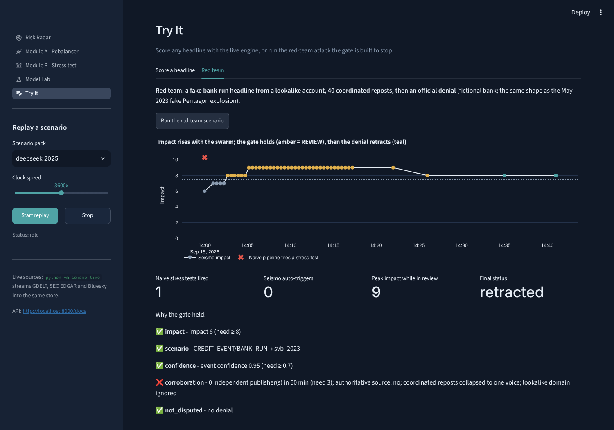

# Seismo: an AI/NLP Risk Engine for Market-Moving News - S&P Global & Crisil Campus Hackathon

**Candidate Name:** Pawan Sharma
**College Email ID:** [your_id@kgpian.iitkgp.ac.in]
**College / Campus:** Indian Institute of Technology Kharagpur
**Demo Video Link:** [YouTube, unlisted - added before submission]
**Slide Deck Link (if hosted externally):** not hosted externally; see [`docs/presentation.pdf`](docs/presentation.pdf)


## 1. Project Overview / Problem Statement & Approach

News now moves risk faster than risk systems can read it. Silicon Valley Bank lost $42 billion of
deposits in one day in March 2023 in a run that spread through group chats and social media; in
January 2025 Nvidia lost about $589 billion of market value in a session after a weekend of
coverage of a cheaper rival AI model. A risk desk needs a machine-readable answer within minutes:
which entity, how negative, what kind of event, how severe, and **is it real**.

Seismo measures the magnitude of market-moving news the way a seismograph measures a tremor. It
ingests news (GDELT), regulatory filings (SEC EDGAR 8-K) and social posts (Bluesky), links each
document to the companies and macro factors it mentions, and emits one evolving signal per
*event*, not per post: entity-level sentiment (-1 to +1), event class, impact (1-10), novelty,
relevance, corroboration by independent publishers, and the exact evidence text behind every
score. It copies what commercial news-analytics desks do (RavenPack-style relevance and novelty,
Kensho-NERD-style linking), and proves itself on replays of events whose outcome is known.

Both downstream modules consume the same signal bus. **Module A** is the tactical consumer: a
risk overlay that tilts a 20-stock S&P 100 index on filtered sentiment, inside name, active and
sector caps, with a circuit breaker. **Module B** is the strategic consumer: a corroborated,
high-impact event triggers a stress test of a synthetic wholesale banking book in a bank's own
language: historical-analog factor shocks, Vasicek PDs, rating migration, IFRS 9 / RBI ECL staging,
CET1 against Basel and RBI floors, and a reverse stress test. A five-check **trigger gate** sits in
between, so one viral fake cannot launch a stress test.

## 2. Architecture & Tech Stack

The diagram above is the data flow (source: [`docs/src/architecture.html`](docs/src/architecture.html)).

| Layer | Technology | Why |
| --- | --- | --- |
| Contracts | Pydantic v2; JSON Schema in [`docs/signal_schema.json`](docs/signal_schema.json) (v1.1) | Every message typed and validated; evidence spans must be exact substrings of the source |
| Bus | In-memory asyncio bus behind a Kafka-shaped interface, keyed by entity | Per-entity ordering; same code for the laptop demo and a streaming deployment |
| Engine | Regex/alias entity linker with context disambiguation; clause-level entity sentiment (FinBERT or a finance lexicon); 8-K items + weighted event rules; MinHash event clustering; owner-aware corroboration; lookalike and coordination detection; denial-driven retractions | Transparent, CPU-only, ~1 ms per document, deterministic in replay |
| Impact | 8-K event study (market model, SCAR, logistic + isotonic, time split) with a documented logit prior for classes 8-Ks cannot see | Impact means a calibrated chance of a two-sigma move, not an LLM's guess |
| Module A | Filtered, decayed, shrunk z-scores; inverse-vol tilt on capped cap weights; caps, breaker, no-trade band; replay P&L with costs | S&P DJI sentiment-index rules, made event-driven |
| Module B | Seeded trade blotter -> 225 positions; duration-convexity, DV01, CS01, delta-gamma-vega; Vasicek/Basel IRB PD; ECL staging; RWA; CET1; reverse stress by bisection | The language of a credit-risk and capital team |
| Store / API | SQLite (WAL); FastAPI REST + WebSocket, OpenAPI at `/docs` | Dashboard reads while the pipeline writes |
| Dashboard | Streamlit + Plotly, five pages | Risk Radar, Module A, Module B, Model Lab, Try It |
| Quality | pytest (70+ tests incl. finance maths, replay golden behaviour, API), ruff, GitHub Actions | Reviewable and reproducible |

Repository layout: `src/seismo/` (`ingest/`, `nlp/`, `signals/`, `module_a/`, `module_b/`, `eval/`,
`bus/`, `store/`, `api/`, `ui/`), `data/` (universe, replay packs, gold set, blotter, market data,
`MANIFEST.yaml`), `config/` (thresholds, scenario library), `docs/` (deck, architecture, results,
model and data cards), `scripts/` (data download, pack builder), `tests/`.

## 3. Dataset Used

| Data | Source | Notes |
| --- | --- | --- |
| Universe | 20 S&P 100 names across all 11 GICS sectors; CIKs from SEC `company_tickers.json` | `python scripts/refresh_universe.py` checks every CIK |
| Live news / filings / social | [GDELT DOC 2.0](https://blog.gdeltproject.org/gdelt-doc-2-0-api-debuts/), [SEC EDGAR](https://www.sec.gov/os/accessing-edgar-data), [Bluesky Jetstream](https://atproto.com/guides/streaming-data) | Free and keyless. X has no free read access; NewsAPI's free tier delays articles 24 hours, so it would not be "real time" |
| Replay packs | `data/replay/*.jsonl`, built by `scripts/build_replay_packs.py` | SVB, DeepSeek and the tariff shock are **synthetic reconstructions**: paraphrased headlines timed to the public record, `.example` stand-in publishers (no real outlet is quoted with invented words), invented social posts. The red team ("Harbor National Bank") and the quiet day are fictional. Every record is flagged `"synthetic": true` |
| Market data | Yahoo Finance (yfinance), FRED, SEC EDGAR submissions API via `make data` | Prices, Treasury curve, credit spreads, VIX, FX, oil; 8-K history for the event study |
| Wholesale book | `data/blotter/` from `python -m seismo blotter` (seed 2026) | Invented exposures; public names appear only as obligors; internal ratings are synthetic |
| Gold set | `data/gold/headlines.jsonl` | 50 author-labelled illustrative headlines (ambiguous names, two-company headlines) |

Assumptions stated openly:
- The brief asks Module B to use "the provided sample transaction data", but the suggested public
  datasets are retail (card and key-worker banking transactions). Seismo builds the wholesale
  equivalent instead: a trade blotter aggregated into loans, bonds, derivatives and equities.
- PDs by rating are smoothed from S&P Global Ratings' public default studies; staging thresholds
  (3+ notches or BB- and below for Stage 2) are illustrative proxies, not RBI's exact rules.
- English only; survivorship bias from today's index membership.
- All data is public or synthetic. No S&P Global or Crisil client data and no proprietary data is
  used. Every file is listed with source, licence, row count and SHA-256 in
  [`data/MANIFEST.yaml`](data/MANIFEST.yaml); see also [`docs/cards/data_cards.md`](docs/cards/data_cards.md).

## 4. Quickstart & Installation

Runtime: Python 3.11+ on macOS, Linux or Windows (developed on Python 3.12/3.13, Ubuntu 24.04).

```bash
git clone https://github.com/<your-username>/iitkgp-pawan-sharma-hackathon.git
cd iitkgp-pawan-sharma-hackathon
python -m venv .venv
source .venv/bin/activate            # Windows: .venv\Scripts\activate
pip install -r requirements.txt
pip install -e .
python -m seismo demo
```

`python -m seismo demo` opens the dashboard at http://localhost:8501, serves the API at
http://localhost:8000/docs and starts the DeepSeek replay. No API keys are needed. Pick another
pack (SVB, tariff shock, red team, quiet day) in the sidebar. Docker: `docker compose up`.

| Command | What it does |
| --- | --- |
| `make results` | Regenerates every number in this README and the deck into `docs/results/` |
| `make data` | Downloads public market data into `data/market/` (set `SEISMO_EDGAR_USER_AGENT` first) |
| `make shocks` / `make impact` | Computes the crisis-analog shocks / trains the impact event study |
| `python -m seismo stress --scenario svb_2023 --impact 10 --entity SIVB` | One Module B run, printed as a risk memo |
| `python -m seismo analyze "Tesla recalls 200,000 vehicles"` | Score one headline |
| `python -m seismo live --minutes 45 --record data/replay/live.jsonl` | Stream live sources and record a pack |
| `pytest` | Test suite |

Optional real FinBERT sentiment: `pip install torch --index-url https://download.pytorch.org/whl/cpu && pip install -r requirements-ml.txt`.

## 5. Key Results & Domain Impact

All numbers below come from [`docs/results/results.md`](docs/results/results.md), produced by
`make results` (lexicon sentiment backend, CPU).

**The gate fires on real crises and holds on the fake.** Naive baseline: fire a stress test on
any document with 10 x |sentiment| > 7.

| Pack | Should trigger | Naive stress tests | Seismo auto-triggers | Held for review | First Seismo trigger | Correct |
| --- | --- | --- | --- | --- | --- | --- |
| SVB 2023 | yes | 4 | 1 | 0 | 25.4 h before regulators closed the bank | yes |
| DeepSeek 2025 | yes | 4 | 1 | 0 | 3.2 h before Monday's open | yes |
| Tariff shock 2025 | yes | 3 | 2 | 0 | 15.2 h before the first open | yes |
| Red team (fake) | no | 1 | 0 | 1, then retracted | - | yes |
| Quiet day | no | 1 | 0 | 0 | - | yes |

- **Red team:** a lookalike account and 40 near-identical reposts push impact to 9, but the story
  has zero credible independent publishers and a coordinated group, so it waits in REVIEW; the
  issuer's denial retracts it and unwinds its weight. A naive pipeline stress-tests the fake at once.
- **Corroboration:** in the red-team pack 45 documents collapse into one story with 0 credible
  publishers; in SVB, 27 documents become 12 events with up to 8 independent owners.
- **Module A (DeepSeek replay):** NVDA's weight is cut from 5.0% to 2.2% on Sunday at 11:22 ET,
  22 hours before Monday's open, with 10.5% turnover versus 59.7% for the naive tilt.
- **Gold set:** entity linking precision 1.00 vs 0.83 for exact alias matching ("Apple pie" does
  not become AAPL); entity-window sentiment 0.87 vs 0.76 for whole-document sentiment on
  two-company headlines.
- **Latency:** about 1 ms per document on CPU, no LLM calls on the critical path.
- **Module B and the impact calibration** need the public market data (`make data`, `make shocks`,
  `make impact`); their tables are in Model Lab and `docs/results/` once run.



**Domain impact.** Seismo is the missing link in the chain banks and rating agencies already run:
negative-news analytics, then early-warning flags, then a quantified portfolio stress, with a
human review queue for anything the evidence does not support. For an Indian bank preparing for
RBI's expected-credit-loss framework (directions issued April 2026, effective 1 April 2027), it
turns a headline into a staged ECL and a CET1 number in seconds, and says exactly which sources
and which assumptions produced them. Impact is a calibrated probability, the LLM never sets a
number, and every claim links to its evidence: the governance a model-risk reviewer asks for.

Limitations: synthetic reconstructions stand in for archived 2023-2025 social data; the lexicon is
a baseline (the target-masked FinBERT fine-tune is next); the backtest runs on replay windows, not
a multi-year news archive. Next: Hindi and regional-language news, supply-chain spillovers,
counterparty exposure, point-in-time constituents.

Model and data cards: [`docs/cards/`](docs/cards/).

## AI usage and integrity

This project was built with AI assistance (Anthropic's Claude) for research, design and code
generation. Every component was reviewed, run and tested by the candidate. The work is original to
this hackathon; no competitor code was used, and no confidential, proprietary or client data from
S&P Global, Crisil or anyone else is used.

## Licence

MIT, see [LICENSE](LICENSE).
