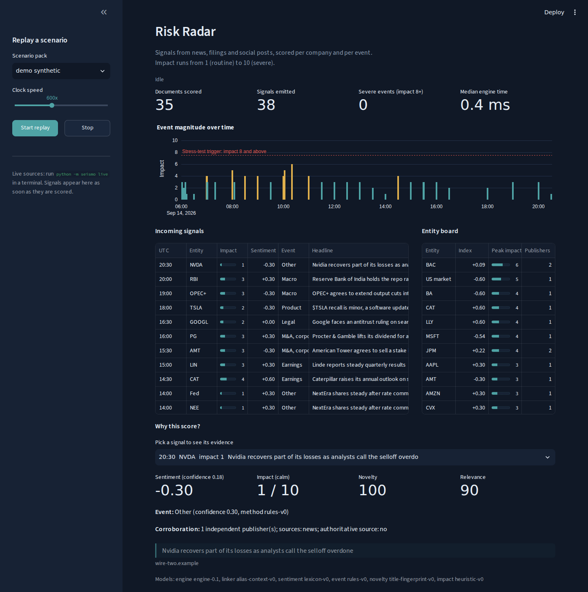

# Seismo: an AI/NLP Risk Engine for Market-Moving News - S&P Global & Crisil Campus Hackathon

**Candidate Name:** Pawan Sharma
**College Email ID:** [your_id@kgpian.iitkgp.ac.in]
**College / Campus:** Indian Institute of Technology Kharagpur
**Demo Video Link:** [YouTube, unlisted - added before submission]
**Slide Deck Link (if hosted externally):** not hosted externally; see [`docs/presentation.pdf`](docs/presentation.pdf)

> Build status: Day 1 of 7. The end-to-end pipeline runs on baseline models; later days replace
> them with the fine-tuned sentiment model, the event-study impact model and both downstream modules.



## 1. Project Overview / Problem Statement & Approach

News now moves risk faster than risk systems can read it. Silicon Valley Bank lost $42 billion of
deposits in a single day in March 2023, in a run that spread on social media, and in January 2025
Nvidia lost about $589 billion of market value in one session after news of a cheaper rival AI
model spread over a weekend. Risk teams need machine-readable signals within minutes: which entity
is affected, how negative the news is, what kind of event it is, and how severe it is likely to be.

Seismo measures the magnitude of market-moving news the way a seismograph measures a tremor. It
ingests financial news (GDELT), regulatory filings (SEC EDGAR 8-K) and social posts (Bluesky),
links each document to the companies and macro factors it mentions, and emits a structured signal
per entity: sentiment from -1 to +1, an event class, an impact score from 1 to 10, plus novelty,
relevance, corroboration and the exact evidence text behind every score.

Signals flow over one bus to two consumers with different horizons: a tactical index rebalancer
(Module A) and a strategic stress test of a wholesale banking book (Module B). Every run can be
replayed deterministically from recorded data, so the demo and the results need no API keys.

## 2. Architecture & Tech Stack

```text
GDELT news ─┐
SEC 8-K ────┼─> adapters ─> bus: docs.raw ─> engine ─────────────────> bus: signals.v1 ─┬─> SQLite store ─> FastAPI (REST, WebSocket)
Bluesky ────┤   (normalize)                  link entities                               ├─> entity aggregator (decayed index)
Replay pack ┘                                classify event                              ├─> Module A (Day 5)
                                             entity-window sentiment                     └─> Module B (Day 4)
                                             credibility, novelty, impact
                                                                                            Streamlit Risk Radar reads the store
```

| Layer | Technology | Why |
| --- | --- | --- |
| Contracts | Pydantic v2, exported JSON Schema ([`docs/signal_schema.json`](docs/signal_schema.json)) | Every message is typed and validated |
| Bus | In-memory asyncio bus behind a Kafka-shaped interface (Redpanda planned) | Same code in a laptop demo and a streaming deployment |
| Engine | Regex and alias entity linking with context disambiguation, FinBERT (lexicon fallback), 8-K item codes plus keyword event rules | Transparent baselines that later models must beat |
| Store | SQLite in WAL mode | The dashboard reads while the pipeline writes |
| API | FastAPI: `/v1/signals`, `/v1/entities`, `/v1/analyze`, WebSocket `/v1/stream`, OpenAPI at `/docs` | Typed service with free documentation |
| Dashboard | Streamlit and Plotly | Live view of signals, severity and evidence |
| Quality | pytest (42 tests incl. a deterministic replay test), ruff, GitHub Actions | Reproducible and reviewable |

## 3. Dataset Used

| Data | Source | Notes |
| --- | --- | --- |
| Company universe | 20 S&P 100 names across all 11 GICS sectors; CIKs from SEC `company_tickers.json` | `python scripts/refresh_universe.py` verifies every CIK against SEC |
| Live news | [GDELT DOC 2.0 API](https://blog.gdeltproject.org/gdelt-doc-2-0-api-debuts/) | Free and keyless; updates every 15 minutes |
| Live filings | [SEC EDGAR current 8-K feed](https://www.sec.gov/os/accessing-edgar-data) | Free; SEC requires a descriptive User-Agent and at most 10 requests per second |
| Live social posts | [Bluesky Jetstream](https://atproto.com/guides/streaming-data) | Free and keyless; X has no free read access |
| Demo replay pack | `data/replay/demo_synthetic.jsonl` | 35 invented documents, every one flagged `"synthetic": true`; none is real news |

Assumptions: English text only; entity linking covers the 20-company universe plus seven macro
entities; macro and geopolitical news that names no tracked entity is attributed to the US equity
market. All data is public or synthetic; no proprietary or client data is used. Every dataset is
listed with its licence in [`data/MANIFEST.yaml`](data/MANIFEST.yaml).

## 4. Quickstart & Installation

Runtime: Python 3.11+ on macOS, Linux or Windows (developed on Python 3.12, Ubuntu 24.04).

```bash
git clone https://github.com/<your-username>/iitkgp-pawan-sharma-hackathon.git
cd iitkgp-pawan-sharma-hackathon
python -m venv .venv
source .venv/bin/activate            # Windows: .venv\Scripts\activate
pip install -r requirements.txt
pip install -e .
python -m seismo demo
```

`python -m seismo demo` opens the Risk Radar at http://localhost:8501, serves the API at
http://localhost:8000/docs and starts the default replay automatically. No API keys are needed.

Optional: real FinBERT sentiment instead of the lexicon fallback.

```bash
pip install torch --index-url https://download.pytorch.org/whl/cpu
pip install -r requirements-ml.txt
```

Live sources and recording a replay pack:

```bash
export SEISMO_EDGAR_USER_AGENT="Your Name your.email@example.com"   # SEC requires this
python -m seismo live --minutes 45 --record data/replay/live_capture.jsonl
python -m seismo replay --pack data/replay/live_capture.jsonl --speed 600 --reset
```

Other commands: `python -m seismo analyze "Tesla recalls 200,000 vehicles"`, `python -m seismo api`,
`python -m seismo ui`, `python -m seismo schema`, and `pytest` for the test suite.

## 5. Key Results & Domain Impact

Current output (Day 1): every document becomes one signal per linked entity, with sentiment, event
class, impact, novelty, relevance, corroboration and evidence spans that are exact substrings of the
source text. Replays are deterministic: the same pack yields identical signal ids and scores.

Quantitative results against naive baselines are produced by `make results` and reported here from
Day 6: sentiment and event accuracy, impact calibration, Module A backtest with costs, Module B
trigger precision, latency and cost per 1,000 documents.

Domain impact: Seismo follows the chain banks and rating agencies already run, from negative-news
analytics to early-warning flags to quantified portfolio stress, and does it with explainable,
reproducible signals.

## Signal contract (schema v1)

```json
{
  "schema_version": "1.0",
  "grain": "document",
  "entity": {"type": "company", "id": "NVDA", "name": "NVIDIA Corp.", "sector": "Information Technology"},
  "sentiment_score": -0.3, "sentiment_confidence": 0.18,
  "event": {"primary": "PRODUCT_STRATEGY", "subtype": "COMPETITIVE_THREAT", "confidence": 0.95},
  "impact_score": 3, "novelty": 100, "relevance": 95,
  "corroboration": {"independent_publishers": 1, "source_types": ["news"], "authoritative": false},
  "evidence": [{"publisher": "market-daily.example", "span": "Nvidia shares slide in premarket after a rival lab releases a cheaper AI model"}]
}
```

Shortened for display; the full schema is in [`docs/signal_schema.json`](docs/signal_schema.json).

## Repository layout

```text
src/seismo/   ingest/ (GDELT, EDGAR, Bluesky, replay) · nlp/ (linker, sentiment, events, novelty,
              credibility, impact) · signals/ · bus/ · store/ · api/ · ui/ · engine.py · runner.py · cli.py
data/         universe.csv, replay packs, MANIFEST.yaml
tests/        unit, adapter-parsing, pipeline and API tests with offline fixtures
docs/         signal schema, images; deck and architecture diagram land here
scripts/      data utilities (universe verification)
```

## AI usage and integrity

This project was built with AI assistance (Anthropic's Claude) for research, design and code
generation. Every component was reviewed, run and tested by the candidate. All work is original to
this hackathon; no confidential, proprietary or client data from S&P Global, Crisil or anyone else
is used.

## Licence

MIT, see [LICENSE](LICENSE).
